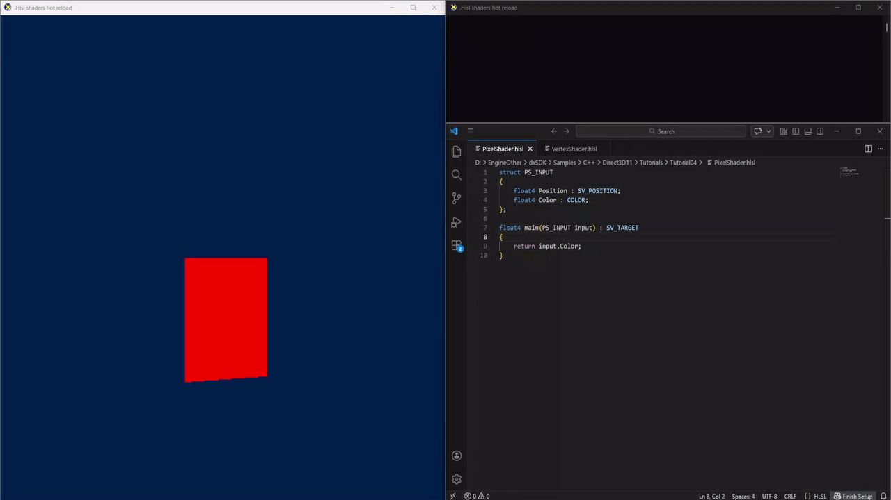

# Hot Reloadable Shaders for hlsl

When you work with Microsoft DirectX 11 hlsl shaders, you have to constantly restart the application to see the result in the modified shaders. This **Single Header file(.h)** file will fix everything and speed up your shader development by **80%.**

## A few words
I have to work quite often with .hlsl shaders and sometimes it starts to get "annoying" to constantly reboot the application in order to apply changes to .in the hlsl shader, 
I came up with the idea to automate this and add hot reload for .hlsl to speed up your development, and I'll say this - it really speeds up shader development a lot. 

## Problems withour Hot Reloadble Shaders
* ❌ Constant application restarts
* ❌ Wasting time on recompilation
* ❌ Interrupting the workflow
## Decision with Hot Reloadable Shaders
* ✅ Automatic recompilation of shaders
* ✅ Instant update in runtime
* ✅ Continuous workflow

## Opportunities
* Load/parse .hlsl shaders
* Watcher for the specified files
* The ability to specify a callback that will be called when the shaders are compiled in a new way.
* Full automatic control, you need to specify the shader data and update it new ones in your render after compiling the shaders.

## What's next?
* Bug Fixes
* Full generation .cso files based on compiled .hlsl
* Support for Geometry, Hull, Compute shaders
* In far future add support for DirectX 12 and OpenGL
* Automatic shader binding after compilation.( at the moment, you are manually getting shaders and binding )

## How to start?
It's simple, clone the repository, take it.open the file and include it in your project. 
**or** 
Without cloning the repository, go to the src folder and open it.open the file and copy the contents.

## Examples
There is a simple example in the demo folder where a 3D cube is spinning on the stage,
just clone the repository, run .sln and assemble the project, launch the application,
open .hlsl it in a text editor, edit file and after saving, you will immediately see the result on the screen. Without recompilation.

## Showcase
### Demonstration of hot reload

---

### Demonstration of error output to the console

## License
**Hot Reloadable Shaders** is licensed under the MIT License, see <a href="LICENSE.txt">LICENSE.txt</a> for more information.
